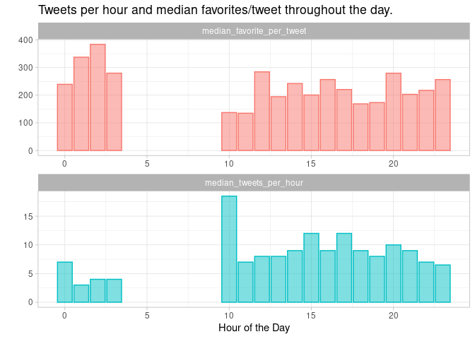
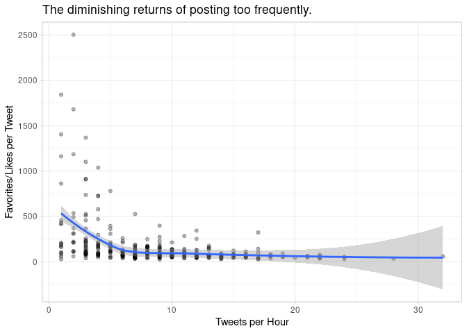
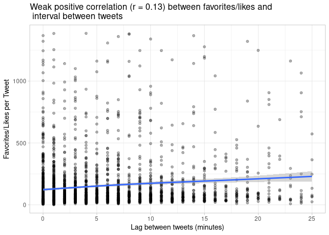

Analysis of Twitter Data
================
June 27th, 2020

> In this analysis I present recommendations about posting frequency on
> Twitter by a Brazilian publisher account (@uolnoticias).

## Twitter Data in R

This analysis is going to use the library `rtweet` to get data from
Twitter and apply some data extraction, cleaning and summaries based on
it.

To install and load the packages, these are the commands needed:

``` r
install.packages("rtweet")
library(rtweet)
```

Then, you need to authenticate to Twitter API in order to be able to
make data requests:

``` r
twitter_token <- create_token(
  consumer_key = "XXX",
  consumer_secret = "XXX",
  access_token = "XXX",
  access_secret = "XXX",
  set_renv = TRUE)
```

### Extracting data from Twitter

This exercise will be to extract the last 3000 tweets from a media
outlet from Brazil (@uolnoticias) and provide a ground report around
some stats.

``` r
uol <- get_timeline("uolnoticias", n = 3000)
head(uol)
```

    ## # A tibble: 6 x 90
    ##   user_id status_id created_at          screen_name text  source
    ##   <chr>   <chr>     <dttm>              <chr>       <chr> <chr> 
    ## 1 145946… 12769592… 2020-06-27 19:23:15 UOLNoticias "Sar… Zapie…
    ## 2 145946… 12769580… 2020-06-27 19:18:10 UOLNoticias "Dep… Twitt…
    ## 3 145946… 12769518… 2020-06-27 18:53:32 UOLNoticias "Ele… Twitt…
    ## 4 145946… 12769518… 2020-06-27 18:53:32 UOLNoticias "Pio… Twitt…
    ## 5 145946… 12769518… 2020-06-27 18:53:31 UOLNoticias "Sue… Twitt…
    ## 6 145946… 12769518… 2020-06-27 18:53:31 UOLNoticias "Fra… Twitt…
    ## # … with 84 more variables: display_text_width <dbl>, reply_to_status_id <chr>,
    ## #   reply_to_user_id <chr>, reply_to_screen_name <chr>, is_quote <lgl>,
    ## #   is_retweet <lgl>, favorite_count <int>, retweet_count <int>,
    ## #   quote_count <int>, reply_count <int>, hashtags <list>, symbols <list>,
    ## #   urls_url <list>, urls_t.co <list>, urls_expanded_url <list>,
    ## #   media_url <list>, media_t.co <list>, media_expanded_url <list>,
    ## #   media_type <list>, ext_media_url <list>, ext_media_t.co <list>,
    ## #   ext_media_expanded_url <list>, ext_media_type <chr>,
    ## #   mentions_user_id <list>, mentions_screen_name <list>, lang <chr>,
    ## #   quoted_status_id <chr>, quoted_text <chr>, quoted_created_at <dttm>,
    ## #   quoted_source <chr>, quoted_favorite_count <int>,
    ## #   quoted_retweet_count <int>, quoted_user_id <chr>, quoted_screen_name <chr>,
    ## #   quoted_name <chr>, quoted_followers_count <int>,
    ## #   quoted_friends_count <int>, quoted_statuses_count <int>,
    ## #   quoted_location <chr>, quoted_description <chr>, quoted_verified <lgl>,
    ## #   retweet_status_id <chr>, retweet_text <chr>, retweet_created_at <dttm>,
    ## #   retweet_source <chr>, retweet_favorite_count <int>,
    ## #   retweet_retweet_count <int>, retweet_user_id <chr>,
    ## #   retweet_screen_name <chr>, retweet_name <chr>,
    ## #   retweet_followers_count <int>, retweet_friends_count <int>,
    ## #   retweet_statuses_count <int>, retweet_location <chr>,
    ## #   retweet_description <chr>, retweet_verified <lgl>, place_url <chr>,
    ## #   place_name <chr>, place_full_name <chr>, place_type <chr>, country <chr>,
    ## #   country_code <chr>, geo_coords <list>, coords_coords <list>,
    ## #   bbox_coords <list>, status_url <chr>, name <chr>, location <chr>,
    ## #   description <chr>, url <chr>, protected <lgl>, followers_count <int>,
    ## #   friends_count <int>, listed_count <int>, statuses_count <int>,
    ## #   favourites_count <int>, account_created_at <dttm>, verified <lgl>,
    ## #   profile_url <chr>, profile_expanded_url <chr>, account_lang <lgl>,
    ## #   profile_banner_url <chr>, profile_background_url <chr>,
    ## #   profile_image_url <chr>

``` r
names(uol)
```

    ##  [1] "user_id"                 "status_id"              
    ##  [3] "created_at"              "screen_name"            
    ##  [5] "text"                    "source"                 
    ##  [7] "display_text_width"      "reply_to_status_id"     
    ##  [9] "reply_to_user_id"        "reply_to_screen_name"   
    ## [11] "is_quote"                "is_retweet"             
    ## [13] "favorite_count"          "retweet_count"          
    ## [15] "quote_count"             "reply_count"            
    ## [17] "hashtags"                "symbols"                
    ## [19] "urls_url"                "urls_t.co"              
    ## [21] "urls_expanded_url"       "media_url"              
    ## [23] "media_t.co"              "media_expanded_url"     
    ## [25] "media_type"              "ext_media_url"          
    ## [27] "ext_media_t.co"          "ext_media_expanded_url" 
    ## [29] "ext_media_type"          "mentions_user_id"       
    ## [31] "mentions_screen_name"    "lang"                   
    ## [33] "quoted_status_id"        "quoted_text"            
    ## [35] "quoted_created_at"       "quoted_source"          
    ## [37] "quoted_favorite_count"   "quoted_retweet_count"   
    ## [39] "quoted_user_id"          "quoted_screen_name"     
    ## [41] "quoted_name"             "quoted_followers_count" 
    ## [43] "quoted_friends_count"    "quoted_statuses_count"  
    ## [45] "quoted_location"         "quoted_description"     
    ## [47] "quoted_verified"         "retweet_status_id"      
    ## [49] "retweet_text"            "retweet_created_at"     
    ## [51] "retweet_source"          "retweet_favorite_count" 
    ## [53] "retweet_retweet_count"   "retweet_user_id"        
    ## [55] "retweet_screen_name"     "retweet_name"           
    ## [57] "retweet_followers_count" "retweet_friends_count"  
    ## [59] "retweet_statuses_count"  "retweet_location"       
    ## [61] "retweet_description"     "retweet_verified"       
    ## [63] "place_url"               "place_name"             
    ## [65] "place_full_name"         "place_type"             
    ## [67] "country"                 "country_code"           
    ## [69] "geo_coords"              "coords_coords"          
    ## [71] "bbox_coords"             "status_url"             
    ## [73] "name"                    "location"               
    ## [75] "description"             "url"                    
    ## [77] "protected"               "followers_count"        
    ## [79] "friends_count"           "listed_count"           
    ## [81] "statuses_count"          "favourites_count"       
    ## [83] "account_created_at"      "verified"               
    ## [85] "profile_url"             "profile_expanded_url"   
    ## [87] "account_lang"            "profile_banner_url"     
    ## [89] "profile_background_url"  "profile_image_url"

### Frequency of Tweets per Hour

As you can see in the list of columns, there is a TON OF DATA coming
from it. Let’s start with a simple tweets counts per hour, of the last
1000 tweets.

``` r
# Loading Libraries
library(ggplot2) # Charts
library(dplyr) # Data Processing
library(tidyr) # Data Processing
library(lubridate) # Date functions

# Tweets per Hour
uol %>%
  filter(is_retweet == F) %>%
  mutate(
    created_at = as.POSIXct(created_at, format="%d-%H:00", tz = -3),
    day_hour = make_datetime(
      year = year(created_at),
      month = month(created_at),
      day = day(created_at),
      hour = hour(created_at)
    )
  ) %>%
  group_by(day_hour) %>%
  summarise(n = length(day_hour)) %>%
  ggplot(aes(y = n, x = day_hour, col = 1, fill = 1)) +
  geom_bar(stat = "identity", alpha = 0.5) +
  theme_light() +
  xlab("Date/Time of the Day") +
  ylab("Tweets/Hour") +
  ggtitle("Tweets per hour by @uolnoticias account") +
  theme(legend.position = "none")
```

<!-- -->

There are some interesting insights here:

  - The number of tweets changes over the course of day, as well as
    compared between days.
  - There is some time of the day where there are no tweets posted.

Let’s take a look at some summary stats:

``` r
# Summary of Tweets per Hour
uol %>%
  filter(is_retweet == F) %>%
  mutate(created_at = as.POSIXct(created_at, format="%d-%H:00", tz = -3),
         day_hour = make_datetime(
           year = year(created_at),
           month = month(created_at),
           day = day(created_at),
           hour = hour(created_at))) %>%
  group_by(day_hour) %>%
  summarise(n = length(day_hour)) %>%
  summary()
```

    ##     day_hour                         n        
    ##  Min.   :2020-06-07 11:00:00   Min.   : 1.00  
    ##  1st Qu.:2020-06-12 03:00:00   1st Qu.: 5.00  
    ##  Median :2020-06-17 13:00:00   Median : 8.00  
    ##  Mean   :2020-06-17 11:55:21   Mean   : 8.57  
    ##  3rd Qu.:2020-06-22 19:00:00   3rd Qu.:12.00  
    ##  Max.   :2020-06-27 19:00:00   Max.   :32.00

``` r
# Boxplot of Tweets per Hour
uol %>%
  filter(is_retweet == F) %>%
  mutate(created_at = as.POSIXct(created_at, format="%d-%H:00", tz = -3),
         day_hour = make_datetime(
           year = year(created_at),
           month = month(created_at),
           day = day(created_at),
           hour = hour(created_at))) %>%
  group_by(day_hour) %>%
  summarise(n = length(day_hour)) %>%
  ggplot(aes(x = factor(hour(day_hour)), y = n, fill = 1, col = 2)) +
  geom_boxplot(alpha = 0.5) +
  theme_light() +
  xlab("Hour of the Day") +
  ylab("Tweets/Hour") +
  ggtitle("Boxplot of tweets per hour across different days by @uolnoticias account") +
  theme(legend.position = "none")
```

<!-- -->

With this summary and boxplot chart, we can learn that:

  - @uolnoticias is posting around 8 tweets/hour.
  - They stop posting at 3AM and start again at 10AM, as people get more
    active and get back to consume their tweets on Tweeter.
  - At 10AM, they have a big number of tweets published. It looks like
    they are all blocked during the night to be posted at 10AM.
  - The number of tweets per hour tend to increase, with peak at 5PM and
    tend to decrease at 8PM.

### Engagement and Posting Frequency

Does engagement data drive the posting frequency throughout the day?
Let’s take a look at number of favorites/likes on tweets and how this
changes throughout the day.

``` r
uol %>%
  filter(is_retweet == F) %>%
  mutate(created_at = as.POSIXct(created_at, format="%d-%H:00", tz = -3),
         hour = hour(created_at),
         day_hour = make_datetime(
           year = year(created_at),
           month = month(created_at),
           day = day(created_at),
           hour = hour(created_at))) %>%
  group_by(day_hour) %>%
  summarise(
    tweets_per_hour = length(hour),
    favorite_per_tweet = mean(favorite_count)
  ) %>%
  mutate(hour = hour(day_hour)) %>%
  group_by(hour) %>%
  summarise(
    median_tweets_per_hour = quantile(tweets_per_hour, 0.5),
    median_favorite_per_tweet = quantile(favorite_per_tweet, 0.5)
  ) %>%
  gather(key = "key", value = "value", -hour) %>%
  ggplot(aes(x = hour, y = value, col = key, fill = key)) +
  geom_bar(stat = "identity", alpha = 0.5) +
  facet_wrap(~ key, nrow = 2, scales = "free") +
  theme_light() +
  xlab("Hour of the Day") +
  ylab("") +
  ggtitle("Tweets per hour and median favorites/tweet throughout the day. ") +
  theme(legend.position="none")
```

<!-- -->

Insights from the chart above:

  - We see that the engagement (favorites) is stronger during the night
    (8PM-3AM) then during the daytime or early evening.
  - Posting activity works in the opposite way, with less tweets/hour in
    the late night, with increasing activity throughout the day until
    8PM.

Question to be investigated:

> With flat engagement while we see an increasing number of tweets, is
> this happening because the higher volume of tweets can be competing
> with each other?

``` r
uol %>%
  filter(is_retweet == F) %>%
  mutate(
    created_at = as.POSIXct(created_at, format="%d-%H:00", tz = -3),
    day_hour = make_datetime(
      year = year(created_at),
      month = month(created_at),
      day = day(created_at),
      hour = hour(created_at)
    )
  ) %>%
  group_by(day_hour) %>%
  summarise(
    tweets_per_hour = length(day_hour),
    favorite_per_tweet = quantile(favorite_count, 0.5)
  ) %>%
  ggplot(aes(y = favorite_per_tweet, x = tweets_per_hour)) +
  geom_point(alpha = 0.3) +
  geom_smooth() +
  theme_light() +
  xlab("Tweets per Hour") +
  ylab("Favorites/Likes per Tweet") +
  ggtitle("The diminishing returns of posting too frequently.") +
  theme(legend.position="none")
```

<!-- -->

Data shows that:

  - As you increase frequency of tweets, the less engagement you get per
    tweet.
  - For optimization, posting at max 6 tweets/hour is good enough to
    extract the higher benefit/tweet.
  - Posting more do contribute with more overall engagement, but the
    return are limited.

### Interval between tweets

Let’s suppose that posting 6 times/hour would give you one tweet at
every 10 minutes. However, we need some evidence to understand if
posting at fixed time intervals are better than posting as the news
happens (no pre-defined schedule).

``` r
uol %>%
  filter(is_retweet == F) %>% # Removing retweets because they don't accrue favorites.
  select(favorite_count, created_at) %>%
  mutate(previous_at = lead(x = created_at, n = 1, order_by = created_at),
         lag_min = as.numeric(previous_at - created_at)/60,
         lag_interval = cut(lag_min, c(0,0.5,1,3,5,10,15,30,60,9999999))) %>%
  filter(!is.na(lag_interval)) %>%
  count(lag_interval) %>%
  ggplot(aes(x = lag_interval, y = n/sum(n)*100, fill = 1, col = 1, 
             label = paste0(round(n/sum(n)*100),"%"))) +
  geom_bar(stat = "identity", alpha = 0.5) +
  geom_label(alpha = 0.7, col = "white", size = 3.5) +
  theme_light() +
  xlab("Interval between tweets posted (in minutes)") +
  ylab("Frequency of Tweets") +
  ggtitle("UOLNoticias is posting more tweets in short intervals") +
  theme(legend.position="none")
```

<!-- -->

As you can see in the chart above, UOLNoticias has a lot of tweets (22%)
being posted in less than 30 seconds. Let’s see how this can impact
engagement:

``` r
uol %>%
  filter(is_retweet == F) %>% # Removing retweets because they don't accrue favorites.
  select(favorite_count, created_at) %>%
  mutate(previous_at = lead(x = created_at, n = 1, order_by = created_at),
         lag_min = as.numeric(previous_at - created_at)/60,
         lag_interval = cut(lag_min, c(0,0.5,1,3,5,10,15,30,60,9999999))) %>%
  filter(!is.na(lag_interval) &
           favorite_count < quantile(favorite_count, 0.95)) %>%
  filter(lag_min < quantile(lag_min, 0.95)) %>%
  ggplot(aes(x = round(lag_min), y = favorite_count)) +
  geom_point(alpha = 0.3) +
  geom_smooth() +
  theme_light() +
  xlab("Lag between tweets (minutes)") +
  ylab("Favorites/Likes per Tweet") +
  ggtitle("Weak positive correlation (r = 0.13) between favorites/likes and \n interval between tweets") +
  theme(legend.position="none")
```

<!-- -->

The data doesn’t support a strong effect of interval between tweets.
Further investigation would be necessary through a causal analysis or
A/B tests.

### Summary and Recommendations

1.  This account is not posting with high frequency during night and
    data shows that this is the time of the day where tweets gets more
    engagement. Although this is a correlation, the editorial team have
    some opportunities to try optimization os posting in this moment.
    This is specially true for the tweets that are blocked to be posted
    until 10AM in the following day.

2.  The number of tweets/hour showed some interesting correlation, with
    an optimal value as 6 tweets/hour. After this frequency, you have
    diminishing returns. Currently, the account is posting on average 8
    tweets/hour. It’s interesting to assess business reasons for posting
    more than 6 tweets/hour and experiment with less tweets per hour.

3.  It’s not possible to be affirmative about the interval between
    tweets, so it’s recommended to experiment with A/B tests or causal
    analysis (using regression analysis on all possible controlled
    effects) to better understand if there is a real effect on
    engagement.
