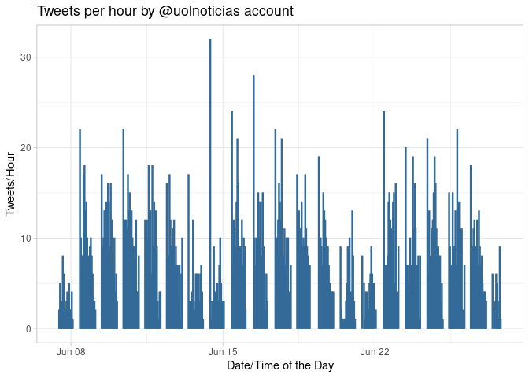
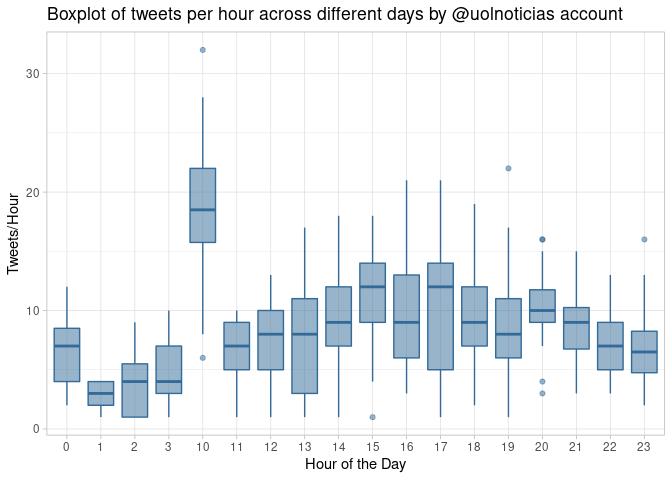

Analysis of Twitter Data
================
Danilo Scorzoni Re
6/27/2020

## Twitter Data in R

This analysis is going to use the library `rtweet` to get data from
Twitter and apply some data extraction, cleaning and summaries based on
it.

To install and load the packages, these are the commands needed:

``` r
install.packages("rtweet")
library(rtweet)
```

Then, you need to authenticate to Twitter API in order to be able to
make data requests:

``` r
twitter_token <- create_token(
  consumer_key = "XXX",
  consumer_secret = "XXX",
  access_token = "XXX",
  access_secret = "XXX",
  set_renv = TRUE)
```

### Extracting data from Twitter

This exercise will be to extract the last 1000 tweets from a media
outlet from Brazil (@uolnoticias) and provide a ground report around
some stats.

``` r
uol <- get_timeline("uolnoticias", n = 1000)
head(uol)
```

    ## # A tibble: 6 x 90
    ##   user_id status_id created_at          screen_name text  source
    ##   <chr>   <chr>     <dttm>              <chr>       <chr> <chr> 
    ## 1 145946… 12769518… 2020-06-27 18:53:32 UOLNoticias "Ele… Twitt…
    ## 2 145946… 12769518… 2020-06-27 18:53:32 UOLNoticias "Pio… Twitt…
    ## 3 145946… 12769518… 2020-06-27 18:53:31 UOLNoticias "Sue… Twitt…
    ## 4 145946… 12769518… 2020-06-27 18:53:31 UOLNoticias "Fra… Twitt…
    ## 5 145946… 12769518… 2020-06-27 18:53:31 UOLNoticias "O e… Twitt…
    ## 6 145946… 12769518… 2020-06-27 18:53:30 UOLNoticias "Jul… Twitt…
    ## # … with 84 more variables: display_text_width <dbl>, reply_to_status_id <chr>,
    ## #   reply_to_user_id <chr>, reply_to_screen_name <chr>, is_quote <lgl>,
    ## #   is_retweet <lgl>, favorite_count <int>, retweet_count <int>,
    ## #   quote_count <int>, reply_count <int>, hashtags <list>, symbols <list>,
    ## #   urls_url <list>, urls_t.co <list>, urls_expanded_url <list>,
    ## #   media_url <list>, media_t.co <list>, media_expanded_url <list>,
    ## #   media_type <list>, ext_media_url <list>, ext_media_t.co <list>,
    ## #   ext_media_expanded_url <list>, ext_media_type <chr>,
    ## #   mentions_user_id <list>, mentions_screen_name <list>, lang <chr>,
    ## #   quoted_status_id <chr>, quoted_text <chr>, quoted_created_at <dttm>,
    ## #   quoted_source <chr>, quoted_favorite_count <int>,
    ## #   quoted_retweet_count <int>, quoted_user_id <chr>, quoted_screen_name <chr>,
    ## #   quoted_name <chr>, quoted_followers_count <int>,
    ## #   quoted_friends_count <int>, quoted_statuses_count <int>,
    ## #   quoted_location <chr>, quoted_description <chr>, quoted_verified <lgl>,
    ## #   retweet_status_id <chr>, retweet_text <chr>, retweet_created_at <dttm>,
    ## #   retweet_source <chr>, retweet_favorite_count <int>,
    ## #   retweet_retweet_count <int>, retweet_user_id <chr>,
    ## #   retweet_screen_name <chr>, retweet_name <chr>,
    ## #   retweet_followers_count <int>, retweet_friends_count <int>,
    ## #   retweet_statuses_count <int>, retweet_location <chr>,
    ## #   retweet_description <chr>, retweet_verified <lgl>, place_url <chr>,
    ## #   place_name <chr>, place_full_name <chr>, place_type <chr>, country <chr>,
    ## #   country_code <chr>, geo_coords <list>, coords_coords <list>,
    ## #   bbox_coords <list>, status_url <chr>, name <chr>, location <chr>,
    ## #   description <chr>, url <chr>, protected <lgl>, followers_count <int>,
    ## #   friends_count <int>, listed_count <int>, statuses_count <int>,
    ## #   favourites_count <int>, account_created_at <dttm>, verified <lgl>,
    ## #   profile_url <chr>, profile_expanded_url <chr>, account_lang <lgl>,
    ## #   profile_banner_url <chr>, profile_background_url <chr>,
    ## #   profile_image_url <chr>

``` r
names(uol)
```

    ##  [1] "user_id"                 "status_id"              
    ##  [3] "created_at"              "screen_name"            
    ##  [5] "text"                    "source"                 
    ##  [7] "display_text_width"      "reply_to_status_id"     
    ##  [9] "reply_to_user_id"        "reply_to_screen_name"   
    ## [11] "is_quote"                "is_retweet"             
    ## [13] "favorite_count"          "retweet_count"          
    ## [15] "quote_count"             "reply_count"            
    ## [17] "hashtags"                "symbols"                
    ## [19] "urls_url"                "urls_t.co"              
    ## [21] "urls_expanded_url"       "media_url"              
    ## [23] "media_t.co"              "media_expanded_url"     
    ## [25] "media_type"              "ext_media_url"          
    ## [27] "ext_media_t.co"          "ext_media_expanded_url" 
    ## [29] "ext_media_type"          "mentions_user_id"       
    ## [31] "mentions_screen_name"    "lang"                   
    ## [33] "quoted_status_id"        "quoted_text"            
    ## [35] "quoted_created_at"       "quoted_source"          
    ## [37] "quoted_favorite_count"   "quoted_retweet_count"   
    ## [39] "quoted_user_id"          "quoted_screen_name"     
    ## [41] "quoted_name"             "quoted_followers_count" 
    ## [43] "quoted_friends_count"    "quoted_statuses_count"  
    ## [45] "quoted_location"         "quoted_description"     
    ## [47] "quoted_verified"         "retweet_status_id"      
    ## [49] "retweet_text"            "retweet_created_at"     
    ## [51] "retweet_source"          "retweet_favorite_count" 
    ## [53] "retweet_retweet_count"   "retweet_user_id"        
    ## [55] "retweet_screen_name"     "retweet_name"           
    ## [57] "retweet_followers_count" "retweet_friends_count"  
    ## [59] "retweet_statuses_count"  "retweet_location"       
    ## [61] "retweet_description"     "retweet_verified"       
    ## [63] "place_url"               "place_name"             
    ## [65] "place_full_name"         "place_type"             
    ## [67] "country"                 "country_code"           
    ## [69] "geo_coords"              "coords_coords"          
    ## [71] "bbox_coords"             "status_url"             
    ## [73] "name"                    "location"               
    ## [75] "description"             "url"                    
    ## [77] "protected"               "followers_count"        
    ## [79] "friends_count"           "listed_count"           
    ## [81] "statuses_count"          "favourites_count"       
    ## [83] "account_created_at"      "verified"               
    ## [85] "profile_url"             "profile_expanded_url"   
    ## [87] "account_lang"            "profile_banner_url"     
    ## [89] "profile_background_url"  "profile_image_url"

As you can see in the list of columns, there is a TON OF DATA coming
from it. Let’s start with a simple tweets counts per hour, of the last
1000 tweets.

``` r
library(ggplot2) # Charts
library(dplyr) # Data Processing
library(tidyr) # Data Processing
library(lubridate) # Date functions

uol %>%
  mutate(created_at = as.POSIXct(created_at, format="%d-%H:00", tz = -3),
         day_hour = make_datetime(
           year = year(created_at),
           month = month(created_at),
           day = day(created_at),
           hour = hour(created_at))) %>%
  group_by(day_hour) %>%
  summarise(n = length(day_hour)) %>%
  ggplot(aes(y = n, x = day_hour)) +
  geom_bar(stat = "identity", alpha = 0.5) +
  theme_light() +
  xlab("Date/Time of the Day") +
  ylab("Tweets/Hour") +
  ggtitle("Tweets per hour by @uolnoticias account")
```

<!-- -->

There are some interesting insights here:

  - The number of tweets changes over the course of day, as well as
    compared between days.
  - There is some time of the day where there are no tweets posted.

Let’s take a look at some summary stats:

``` r
uol %>%
  mutate(created_at = as.POSIXct(created_at, format="%d-%H:00", tz = -3),
         day_hour = make_datetime(
           year = year(created_at),
           month = month(created_at),
           day = day(created_at),
           hour = hour(created_at))) %>%
  group_by(day_hour) %>%
  summarise(n = length(day_hour)) %>%
  summary()
```

    ##     day_hour                         n         
    ##  Min.   :2020-06-20 18:00:00   Min.   : 1.000  
    ##  1st Qu.:2020-06-22 16:30:00   1st Qu.: 5.000  
    ##  Median :2020-06-24 12:00:00   Median : 8.000  
    ##  Mean   :2020-06-24 07:56:28   Mean   : 8.403  
    ##  3rd Qu.:2020-06-25 23:30:00   3rd Qu.:11.000  
    ##  Max.   :2020-06-27 18:00:00   Max.   :24.000

``` r
uol %>%
  mutate(created_at = as.POSIXct(created_at, format="%d-%H:00", tz = -3),
         day_hour = make_datetime(
           year = year(created_at),
           month = month(created_at),
           day = day(created_at),
           hour = hour(created_at))) %>%
  group_by(day_hour) %>%
  summarise(n = length(day_hour)) %>%
  ggplot(aes(x = factor(hour(day_hour)), y = n)) +
  geom_boxplot() +
  theme_light() +
  xlab("Hour of the Day") +
  ylab("Tweets/Hour") +
  ggtitle("Boxplot of tweets per hour across different days by @uolnoticias account")
```

<!-- -->

If this summary and boxplot chart, we can learn that:

  - @uolnoticias is posting around 8 tweets/hour.
  - They stop posting at 3AM and start again at 10AM, as people get more
    active and get back to consume their tweets on Tweeter.
  - At 10AM, they have a big number of tweets published. It looks like
    they are all blocked during the night to be posted at 10AM.
  - The number of tweets per hour tend to increase around 18PM and tend
    to decrease at 22PM.
