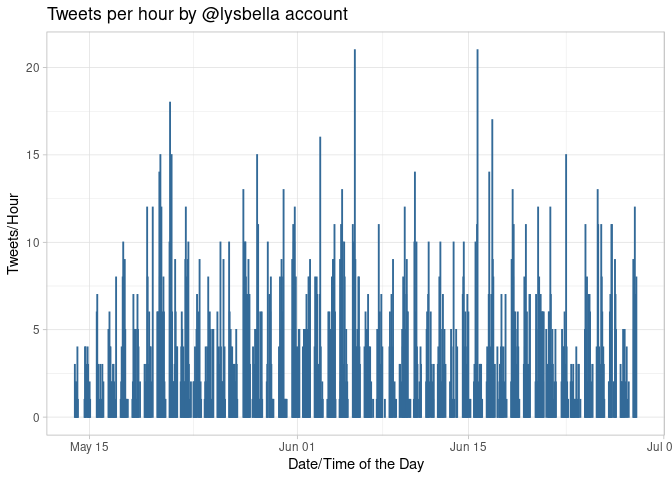
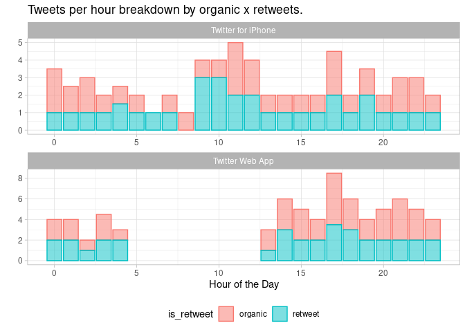
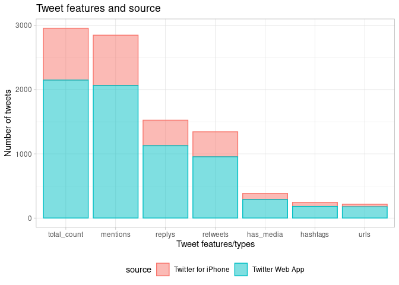
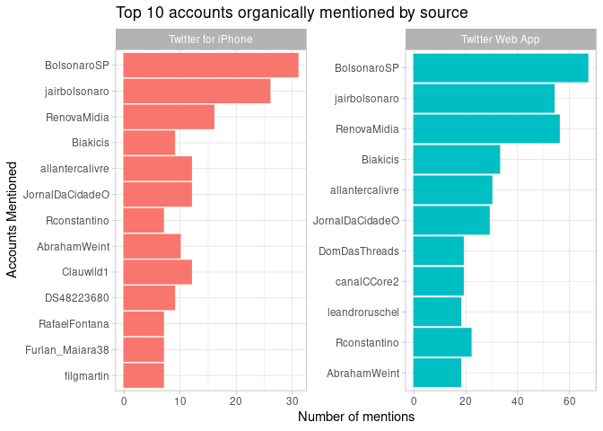

Twitter Account Investigation
================
June 27th, 2020

> In this analysis we will explore some signals about a specific account
> that can bring evidence about an automated behavior.

## Account Automation

Twitter has a pretty open API and this access to Twitter can be
automated using many different softwares. Some of them are very popular
and widely used by Social Media teams, but at the same time, someone can
create a new programming to automate specific tasks. Many political
actors have been using this kind of automation to spread content and
inflate reach of hashtags, for example, artificially.

In this analysis we’re going to use Twitter API data for a specific
account to see signals of automation.

## Getting Data from Twitter API

This analysis is going to use the library `rtweet` to get data from
Twitter and apply some data extraction, cleaning and summaries based on
it.

To install and load the packages, these are the commands needed:

``` r
install.packages("rtweet")
library(rtweet)
```

Then, you need to authenticate to Twitter API in order to be able to
make data requests:

``` r
twitter_token <- create_token(
  consumer_key = "XXX",
  consumer_secret = "XXX",
  access_token = "XXX",
  access_secret = "XXX",
  set_renv = TRUE)
```

To select an account for investigation, I’m going to an account that is
replying to a politician tweet (@jairbolsonaro) with a content that is
not related to what he posted: @lysbella

``` r
acc <- get_timeline("lysbella", n = 3000)
head(acc)
```

    ## # A tibble: 6 x 90
    ##   user_id status_id created_at          screen_name text  source
    ##   <chr>   <chr>     <dttm>              <chr>       <chr> <chr> 
    ## 1 335766… 12773127… 2020-06-28 18:47:48 Lysbella    "@Lu… Twitt…
    ## 2 335766… 12773123… 2020-06-28 18:46:01 Lysbella    "(1/… Twitt…
    ## 3 335766… 12773115… 2020-06-28 18:42:50 Lysbella    "Alg… Twitt…
    ## 4 335766… 12773110… 2020-06-28 18:41:03 Lysbella    "@Re… Twitt…
    ## 5 335766… 12773093… 2020-06-28 18:34:07 Lysbella    "WHO… Twitt…
    ## 6 335766… 12773048… 2020-06-28 18:16:22 Lysbella    "#Go… Twitt…
    ## # … with 84 more variables: display_text_width <dbl>, reply_to_status_id <chr>,
    ## #   reply_to_user_id <chr>, reply_to_screen_name <chr>, is_quote <lgl>,
    ## #   is_retweet <lgl>, favorite_count <int>, retweet_count <int>,
    ## #   quote_count <int>, reply_count <int>, hashtags <list>, symbols <list>,
    ## #   urls_url <list>, urls_t.co <list>, urls_expanded_url <list>,
    ## #   media_url <list>, media_t.co <list>, media_expanded_url <list>,
    ## #   media_type <list>, ext_media_url <list>, ext_media_t.co <list>,
    ## #   ext_media_expanded_url <list>, ext_media_type <chr>,
    ## #   mentions_user_id <list>, mentions_screen_name <list>, lang <chr>,
    ## #   quoted_status_id <chr>, quoted_text <chr>, quoted_created_at <dttm>,
    ## #   quoted_source <chr>, quoted_favorite_count <int>,
    ## #   quoted_retweet_count <int>, quoted_user_id <chr>, quoted_screen_name <chr>,
    ## #   quoted_name <chr>, quoted_followers_count <int>,
    ## #   quoted_friends_count <int>, quoted_statuses_count <int>,
    ## #   quoted_location <chr>, quoted_description <chr>, quoted_verified <lgl>,
    ## #   retweet_status_id <chr>, retweet_text <chr>, retweet_created_at <dttm>,
    ## #   retweet_source <chr>, retweet_favorite_count <int>,
    ## #   retweet_retweet_count <int>, retweet_user_id <chr>,
    ## #   retweet_screen_name <chr>, retweet_name <chr>,
    ## #   retweet_followers_count <int>, retweet_friends_count <int>,
    ## #   retweet_statuses_count <int>, retweet_location <chr>,
    ## #   retweet_description <chr>, retweet_verified <lgl>, place_url <chr>,
    ## #   place_name <chr>, place_full_name <chr>, place_type <chr>, country <chr>,
    ## #   country_code <chr>, geo_coords <list>, coords_coords <list>,
    ## #   bbox_coords <list>, status_url <chr>, name <chr>, location <chr>,
    ## #   description <chr>, url <lgl>, protected <lgl>, followers_count <int>,
    ## #   friends_count <int>, listed_count <int>, statuses_count <int>,
    ## #   favourites_count <int>, account_created_at <dttm>, verified <lgl>,
    ## #   profile_url <chr>, profile_expanded_url <chr>, account_lang <lgl>,
    ## #   profile_banner_url <chr>, profile_background_url <chr>,
    ## #   profile_image_url <chr>

``` r
names(acc)
```

    ##  [1] "user_id"                 "status_id"              
    ##  [3] "created_at"              "screen_name"            
    ##  [5] "text"                    "source"                 
    ##  [7] "display_text_width"      "reply_to_status_id"     
    ##  [9] "reply_to_user_id"        "reply_to_screen_name"   
    ## [11] "is_quote"                "is_retweet"             
    ## [13] "favorite_count"          "retweet_count"          
    ## [15] "quote_count"             "reply_count"            
    ## [17] "hashtags"                "symbols"                
    ## [19] "urls_url"                "urls_t.co"              
    ## [21] "urls_expanded_url"       "media_url"              
    ## [23] "media_t.co"              "media_expanded_url"     
    ## [25] "media_type"              "ext_media_url"          
    ## [27] "ext_media_t.co"          "ext_media_expanded_url" 
    ## [29] "ext_media_type"          "mentions_user_id"       
    ## [31] "mentions_screen_name"    "lang"                   
    ## [33] "quoted_status_id"        "quoted_text"            
    ## [35] "quoted_created_at"       "quoted_source"          
    ## [37] "quoted_favorite_count"   "quoted_retweet_count"   
    ## [39] "quoted_user_id"          "quoted_screen_name"     
    ## [41] "quoted_name"             "quoted_followers_count" 
    ## [43] "quoted_friends_count"    "quoted_statuses_count"  
    ## [45] "quoted_location"         "quoted_description"     
    ## [47] "quoted_verified"         "retweet_status_id"      
    ## [49] "retweet_text"            "retweet_created_at"     
    ## [51] "retweet_source"          "retweet_favorite_count" 
    ## [53] "retweet_retweet_count"   "retweet_user_id"        
    ## [55] "retweet_screen_name"     "retweet_name"           
    ## [57] "retweet_followers_count" "retweet_friends_count"  
    ## [59] "retweet_statuses_count"  "retweet_location"       
    ## [61] "retweet_description"     "retweet_verified"       
    ## [63] "place_url"               "place_name"             
    ## [65] "place_full_name"         "place_type"             
    ## [67] "country"                 "country_code"           
    ## [69] "geo_coords"              "coords_coords"          
    ## [71] "bbox_coords"             "status_url"             
    ## [73] "name"                    "location"               
    ## [75] "description"             "url"                    
    ## [77] "protected"               "followers_count"        
    ## [79] "friends_count"           "listed_count"           
    ## [81] "statuses_count"          "favourites_count"       
    ## [83] "account_created_at"      "verified"               
    ## [85] "profile_url"             "profile_expanded_url"   
    ## [87] "account_lang"            "profile_banner_url"     
    ## [89] "profile_background_url"  "profile_image_url"

## Posting frequency

The first that we can check is the posting frequency pattern. Automated
accounts can be posting by fixed intervals and fixed frequency, and also
with a high number of tweets in a short period of time. Let’s check it
out:

``` r
# Loading Libraries
library(ggplot2) # Charts
library(dplyr) # Data Processing
library(tidyr) # Data Processing
library(lubridate) # Date functions

# Tweets per Hour
acc %>%
  mutate(
    created_at = as.POSIXct(created_at, format="%d-%H:00", tz = -3),
    day_hour = make_datetime(
      year = year(created_at),
      month = month(created_at),
      day = day(created_at),
      hour = hour(created_at)
    )
  ) %>%
  group_by(day_hour) %>%
  summarise(n = length(day_hour)) %>%
  ggplot(aes(y = n, x = day_hour, col = 1, fill = 1)) +
  geom_bar(stat = "identity", alpha = 0.5) +
  theme_light() +
  xlab("Date/Time of the Day") +
  ylab("Tweets/Hour") +
  ggtitle("Tweets per hour by @lysbella account") +
  theme(legend.position = "none")
```

<!-- -->

``` r
acc %>%
  mutate(
    created_at = as.POSIXct(created_at, format="%d-%H:00", tz = -3),
    day_hour = make_datetime(
      year = year(created_at),
      month = month(created_at),
      day = day(created_at),
      hour = hour(created_at)
    )
  ) %>%
  group_by(day_hour) %>%
  summarise(n = length(day_hour)) %>%
  summary()
```

    ##     day_hour                         n         
    ##  Min.   :2020-05-13 19:00:00   Min.   : 1.000  
    ##  1st Qu.:2020-05-25 14:15:00   1st Qu.: 2.000  
    ##  Median :2020-06-05 02:30:00   Median : 4.000  
    ##  Mean   :2020-06-05 18:47:52   Mean   : 4.492  
    ##  3rd Qu.:2020-06-17 09:45:00   3rd Qu.: 6.000  
    ##  Max.   :2020-06-28 18:00:00   Max.   :21.000

As the chart shows, the typical pattern of posting frequency is 4
tweets/hour (median), with a spike of 21 tweets/hour. It’s not that much
considering hourly data, but one signal that is interesting is how
constant this account is posting. You can see in the chart that this
account is posting every day, and it’s a very consistent behavior. Let’s
take a look at behavior throughout the day:

``` r
acc %>%
  mutate(created_at = as.POSIXct(created_at, format="%d-%H:00", tz = -3),
         is_retweet = ifelse(is_retweet, 'retweet','organic'),
         hour = hour(created_at),
         day_hour = make_datetime(
           year = year(created_at),
           month = month(created_at),
           day = day(created_at),
           hour = hour(created_at))) %>%
  group_by(day_hour, is_retweet, source) %>%
  summarise(
    tweets_per_hour = length(hour)
  ) %>%
  mutate(hour = hour(day_hour)) %>%
  group_by(hour, is_retweet, source) %>%
  summarise(
    median_tweets_per_hour = quantile(tweets_per_hour, 0.5)
  ) %>%
  ggplot(aes(x = hour, y = median_tweets_per_hour, col = is_retweet, fill = is_retweet)) +
  geom_bar(stat = "identity", alpha = 0.5) +
  facet_wrap(~ source, nrow = 2, scales = "free") +
  theme_light() +
  xlab("Hour of the Day") +
  ylab("") +
  ggtitle("Tweets per hour breakdown by organic x retweets. ") +
  theme(legend.position="bottom")
```

<!-- -->

So, as you can see, this account doesn’t sleep. They keep posting at
late night, maintaining a balance of retweets and organic content. This
is a bit suspected as it’s not a usual behavior. Also, it’s interesting
that the Twitter Web App is not used throughout the night, only during
daytime, while activity remains constant on Twitter for iPhone.

## Hashtags and Mentions

Mentioned above, some accounts are automated to boost hashtags. Let’s
take a look on what were the most mentioned hashtags as well as the
frequency of hashtags used:

``` r
acc %>%
  group_by(source) %>%
  summarise(
    total_count = length(status_id),
    replys = sum(!is.na(reply_to_status_id)),
    retweets = sum(is_retweet),
    has_media = sum(!is.na(media_type)),
    urls = sum(!is.na(urls_url)),
    hashtags = sum(!is.na(hashtags)),
    mentions = sum(!is.na(mentions_user_id))) %>%
  gather(key = "key", value = "value", -source) %>%
  ggplot(aes(x = reorder(key, -value), y = value, col = source, fill = source)) +
  geom_bar(stat = "identity", alpha = 0.5) +
  theme_light() +
  xlab("Tweet features/types") +
  ylab("Number of tweets") +
  ggtitle("Tweet features and source") +
  theme(legend.position="bottom")
```

<!-- -->

The biggest volume of tweets happens through the Web interface. Also,
you can see that almost all tweets were mentioning someone. This is a
strategy to bring more visibility to specific accounts and it can be
seen as a growth lever for other accounts. Retweets were almost half,
and hashtags were not a big share of all posts. So, it doesn’t look like
this account is trying to boost hashtags, but mentions can be used to
boost growth of some specific accounts. Let’s take a look at the
accounts mentioned:

``` r
acc %>%
  filter(is_retweet == F) %>%
  select(status_id, source, mentions_screen_name) %>%
  unnest(mentions_screen_name) %>%
  filter(!is.na(mentions_screen_name)) %>%
  group_by(source, mentions_screen_name) %>%
  summarise(
    n = length(source)
  ) %>%
  arrange(-n) %>%
  top_n(10) %>%
  ggplot(aes(x = reorder(mentions_screen_name, n), y = n, col = source, fill = source)) +
  geom_bar(stat = "identity") +
  facet_wrap(~ source, scales = "free") +
  coord_flip() +
  theme_light() +
  xlab("Accounts Mentioned") +
  ylab("Number of mentions") +
  ggtitle("Top 10 accounts organically mentioned by source") +
  theme(legend.position="none")
```

<!-- -->

Here we need some context about Brazil politics. These accounts are all
related to Brazilian president, his family, other politicians that
support him and news websites used by them. One case here we have
@jornaldacidadeo, an account being flagged multiple times about fake
news/hate speech and being targeted by [Sleeping
Giants](https://twitter.com/slpng_giants_pt) movement.

## Repetitive Content

Finally, let’s make a quick check on organic content being posted to see
if there are repetitive content on it.

``` r
acc %>%
  filter(is_retweet == F) %>%
  group_by(user_id) %>%
  summarise(
    n = length(text),
    distinct = n_distinct(text),
    distinct_pct = distinct/n
  )
```

    ## # A tibble: 1 x 4
    ##   user_id      n distinct distinct_pct
    ##   <chr>    <int>    <int>        <dbl>
    ## 1 33576610  1613     1612        0.999

> 99.9% of tweets from this account are distinct, which means that this
> account isn’t posting repetitive content.

## Summary

  - This account presents a posting pattern that is not typical, due to
    constant posting (including late night hours) and the breakdown
    between iPhone and Web sources.
  - Although we couldn’t find signals of hashtag boosting, this account
    is mentioning other accounts in almost all tweets. This is a
    strategy for boost growth of accounts and might being be used for
    this purpose.
  - Accounts with more mentions are all related to the politician that
    we used first to select this account, being used as a echo chamber
    for this discourse.
