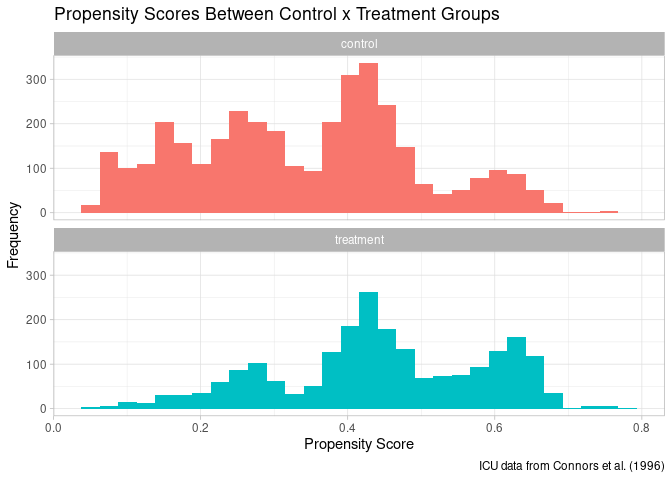
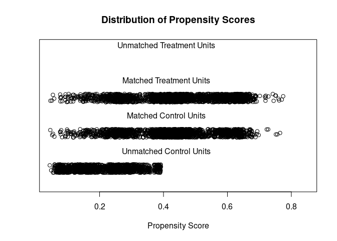
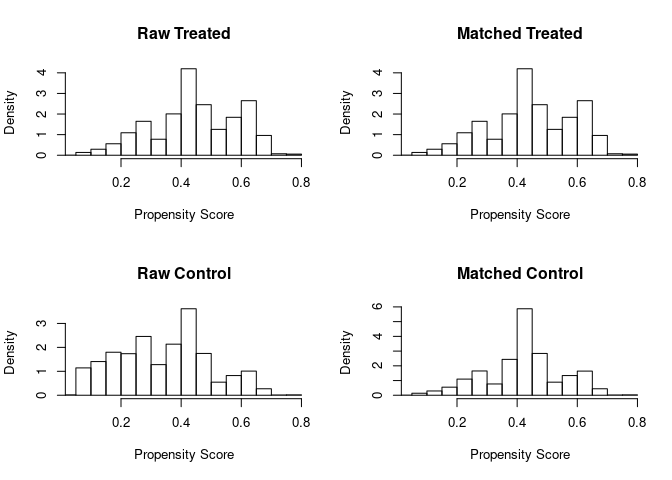

Causal Analysis - RHC Dataset
================
July 16th, 2020

## Causal Analysis

This is a class exercise on Causal Analysis training from Coursera’s
[Crash Course in
Causality](http://www.coursera.org/learn/crash-course-in-causality) -
Week 3 (Matching).

### RHC Dataset

This dataset was used in Connors et al. (1996): The effectiveness of RHC
in the initial care of critically ill patients. J American Medical
Association 276:889-897. The dataset pertains to day 1 of
hospitalization, i.e., the “treatment” variable swang1 is whether or not
a patient received a RHC (also called the Swan-Ganz catheter) on the
first day in which the patient qualified for the SUPPORT study (see
above). The dataset is suitable for use in papers submitted in response
to the call for papers on causal inference, by the journal Health
Services and Outcomes Research Methodology. The original analysis by
Connors et al. used binary logistic model to develop a propensity score
that was then used for matching RHC patients with non-RHC patients. A
sensitivity analysis was also done. The results provided some evidence
that patients receiving RHC had decreased survival time, and the
sensitivity analysis indicated that any unmeasured confounder would have
to be somewhat strong to explain away the results. See Lin DY, Psaty BM,
Kronmal RA (1998): Assessing the sensitivity of regression results to
unmeasured confounders in observational studies. Biometrics 54:948-963
for useful methods for sensitivity analysis, one of which was applied to
the RHC results.

This data was extracted from [this
website](http://biostat.mc.vanderbilt.edu/wiki/Main/DataSets).

### Loading the Data

``` r
# Loading the data
load(url("http://biostat.mc.vanderbilt.edu/wiki/pub/Main/DataSets/rhc.sav"))
```

### Preparing the dataset

The data is highly coded and we wanted to filter some columns and codify
some covariates as 0 or 1’s.

``` r
ARF = as.numeric(rhc$cat1 == "ARF")
CHF = as.numeric(rhc$cat1 == "CHF")
Cirr = as.numeric(rhc$cat1 == "Cirrhosis")
colcan = as.numeric(rhc$cat1 == "Colon Cancer")
Coma = as.numeric(rhc$cat1 == "Coma")
COPD = as.numeric(rhc$cat1 == "COPD")
lungcan = as.numeric(rhc$cat1 == "Lung Cancer")
MOSF = as.numeric(rhc$cat1 == "MOSF w/Malignancy")
sepsis = as.numeric(rhc$cat1 == "MOSF w/Sepsis")
female = as.numeric(rhc$sex == "Female")
died = as.numeric(rhc$death == "Yes")
age = rhc$age
treatment = as.numeric(rhc$swang1 == "RHC")
meanbp1 <- rhc$meanbp1

mydata = data.frame(
  cbind(ARF, CHF, Cirr, colcan, Coma, lungcan, MOSF, sepsis, age, female, meanbp1, treatment, died)
)
xvars = colnames(mydata)[1:11]

head(mydata)
```

    ##   ARF CHF Cirr colcan Coma lungcan MOSF sepsis      age female meanbp1
    ## 1   0   0    0      0    0       0    0      0 70.25098      0      41
    ## 2   0   0    0      0    0       0    0      1 78.17896      1      63
    ## 3   0   0    0      0    0       0    1      0 46.09198      1      57
    ## 4   1   0    0      0    0       0    0      0 75.33197      1      55
    ## 5   0   0    0      0    0       0    0      1 67.90997      0      65
    ## 6   0   0    0      0    0       0    0      0 86.07794      1     115
    ##   treatment died
    ## 1         0    0
    ## 2         1    1
    ## 3         1    0
    ## 4         0    1
    ## 5         1    1
    ## 6         0    0

### Pre-matching

Now that the data is ready to use, let’s check how balanced it is,
before the matching exercise:

``` r
# Libraries
library(tableone)
library(Matching)

table1 = CreateTableOne(vars = xvars, strata = "treatment", data = mydata, test = F)
print(table1, smd = T)
```

    ##                      Stratified by treatment
    ##                       0             1             SMD   
    ##   n                    3551          2184               
    ##   ARF (mean (SD))      0.45 (0.50)   0.42 (0.49)   0.059
    ##   CHF (mean (SD))      0.07 (0.25)   0.10 (0.29)   0.095
    ##   Cirr (mean (SD))     0.05 (0.22)   0.02 (0.15)   0.145
    ##   colcan (mean (SD))   0.00 (0.04)   0.00 (0.02)   0.038
    ##   Coma (mean (SD))     0.10 (0.29)   0.04 (0.20)   0.207
    ##   lungcan (mean (SD))  0.01 (0.10)   0.00 (0.05)   0.095
    ##   MOSF (mean (SD))     0.07 (0.25)   0.07 (0.26)   0.018
    ##   sepsis (mean (SD))   0.15 (0.36)   0.32 (0.47)   0.415
    ##   age (mean (SD))     61.76 (17.29) 60.75 (15.63)  0.061
    ##   female (mean (SD))   0.46 (0.50)   0.41 (0.49)   0.093
    ##   meanbp1 (mean (SD)) 84.87 (38.87) 68.20 (34.24)  0.455

You can see many columns with unbalances, which means SMD \> 0.1, such
as: Cirr, Coma, sepsis, etc. To solve for those unbalances, we need to
match the data.

### Greedy Match

``` r
greedymatch = Match(Tr = treatment, M = 1, X = mydata[xvars])
# M = 1 to get one match per treatment subject

# Then we extract from the output the index for treated and control subjects
matched = mydata[unlist(greedymatch[c("index.treated","index.control")]),]

# Then let's check for unbalances again
matchedtab1 = CreateTableOne(vars = xvars, strata = "treatment", data = matched, test = F)
print(matchedtab1, smd = T)
```

    ##                      Stratified by treatment
    ##                       0             1             SMD   
    ##   n                    2186          2186               
    ##   ARF (mean (SD))      0.42 (0.49)   0.42 (0.49)  <0.001
    ##   CHF (mean (SD))      0.10 (0.29)   0.10 (0.29)  <0.001
    ##   Cirr (mean (SD))     0.02 (0.15)   0.02 (0.15)  <0.001
    ##   colcan (mean (SD))   0.00 (0.02)   0.00 (0.02)  <0.001
    ##   Coma (mean (SD))     0.04 (0.20)   0.04 (0.20)  <0.001
    ##   lungcan (mean (SD))  0.00 (0.05)   0.00 (0.05)  <0.001
    ##   MOSF (mean (SD))     0.07 (0.26)   0.07 (0.26)  <0.001
    ##   sepsis (mean (SD))   0.32 (0.47)   0.32 (0.47)  <0.001
    ##   age (mean (SD))     60.84 (15.54) 60.77 (15.64)  0.005
    ##   female (mean (SD))   0.41 (0.49)   0.41 (0.49)  <0.001
    ##   meanbp1 (mean (SD)) 68.26 (33.23) 68.19 (34.23)  0.002

Now we have a very good balance, given all covariates SMD \< 0.1.

### Outcome

Now that we have a balanced matched set of observations, let’s proceed
with outcome analysis. In this case we have treatment x control and the
outcome variable is died.

``` r
y_trt = matched$died[matched$treatment == 1]
y_con = matched$died[matched$treatment == 0]

# Pairwise the difference
diffy = y_trt - y_con

# Paried test
t.test(diffy)
```

    ## 
    ##  One Sample t-test
    ## 
    ## data:  diffy
    ## t = 3.3318, df = 2185, p-value = 0.0008773
    ## alternative hypothesis: true mean is not equal to 0
    ## 95 percent confidence interval:
    ##  0.01863193 0.07194447
    ## sample estimates:
    ## mean of x 
    ## 0.0452882

So, as a summary:

  - Point estimate (of difference): **0.045**
      - Difference in probability of death if everyone received RHC
        versus if no one received RHC is 0.045 (higher risk of death in
        RHC group).
  - 95% Confidence Interval: **(0.019, 0.072)**
  - p-value **\< 0.001**

## Using Propensity Scores

Now we’re going to perform the analysis with the same dataset in the
previous exercise but using propensity scores to perform the matching.

### Fitting the propensity score

The propensity score is a logistic regression where the outcome variable
(y) is the treatment. The covariates (X) are used to estimate the
probability of having treatment assigned. We don’t use the real outcome
of the study (died) here at this moment.

``` r
# Logistic Regression Model
psmodel = glm(treatment ~ ARF + CHF + Cirr + colcan + Coma + lungcan +
                MOSF + sepsis + age + female + meanbp1, 
              family = binomial(), data = mydata)

# Check the coefficients
summary(psmodel)
```

    ## 
    ## Call:
    ## glm(formula = treatment ~ ARF + CHF + Cirr + colcan + Coma + 
    ##     lungcan + MOSF + sepsis + age + female + meanbp1, family = binomial(), 
    ##     data = mydata)
    ## 
    ## Deviance Residuals: 
    ##     Min       1Q   Median       3Q      Max  
    ## -1.7013  -1.0097  -0.6336   1.1814   2.4791  
    ## 
    ## Coefficients:
    ##               Estimate Std. Error z value Pr(>|z|)    
    ## (Intercept) -0.7299670  0.1997692  -3.654 0.000258 ***
    ## ARF          1.2931956  0.1487784   8.692  < 2e-16 ***
    ## CHF          1.6804704  0.1715672   9.795  < 2e-16 ***
    ## Cirr         0.5234506  0.2181458   2.400 0.016416 *  
    ## colcan       0.0295468  1.0985361   0.027 0.978542    
    ## Coma         0.7013451  0.1854937   3.781 0.000156 ***
    ## lungcan     -0.0869570  0.5039331  -0.173 0.863000    
    ## MOSF         1.3046587  0.1772705   7.360 1.84e-13 ***
    ## sepsis       2.0433604  0.1545437  13.222  < 2e-16 ***
    ## age         -0.0031374  0.0017289  -1.815 0.069567 .  
    ## female      -0.1697903  0.0583574  -2.909 0.003620 ** 
    ## meanbp1     -0.0109824  0.0008217 -13.366  < 2e-16 ***
    ## ---
    ## Signif. codes:  0 '***' 0.001 '**' 0.01 '*' 0.05 '.' 0.1 ' ' 1
    ## 
    ## (Dispersion parameter for binomial family taken to be 1)
    ## 
    ##     Null deviance: 7621.4  on 5734  degrees of freedom
    ## Residual deviance: 6983.6  on 5723  degrees of freedom
    ## AIC: 7007.6
    ## 
    ## Number of Fisher Scoring iterations: 4

``` r
# Create propensity score
mydata$pscore = psmodel$fitted.values

# Checking the charts between treatment and control groups
library(ggplot2)
library(dplyr)

mydata %>%
  mutate(treatment = ifelse(treatment == 1, "treatment","control")) %>%
  ggplot(aes(x = pscore, fill = treatment)) +
  geom_histogram() +
  facet_wrap(~ treatment, ncol = 1) +
  ggtitle("Propensity Scores Between Control x Treatment Groups") +
  xlab("Propensity Score") +
  ylab("Frequency") +
  theme_light() +
  theme(legend.position = "none") +
  labs(caption = "ICU data from Connors et al. (1996)") 
```

<!-- -->

The data shows to have a good overlap between treatment and control,
with tails being covered. Let’s proceed with matching using propensity
score.

``` r
library(MatchIt)

m.out = matchit(treatment ~ ARF + CHF + Cirr + colcan + Coma + lungcan +
                MOSF + sepsis + age + female + meanbp1, 
                data = mydata, method = "nearest")

summary(m.out)
```

    ## 
    ## Call:
    ## matchit(formula = treatment ~ ARF + CHF + Cirr + colcan + Coma + 
    ##     lungcan + MOSF + sepsis + age + female + meanbp1, data = mydata, 
    ##     method = "nearest")
    ## 
    ## Summary of balance for all data:
    ##          Means Treated Means Control SD Control Mean Diff eQQ Med eQQ Mean
    ## distance        0.4456        0.3410     0.1526    0.1046  0.1133   0.1047
    ## ARF             0.4162        0.4452     0.4971   -0.0290  0.0000   0.0288
    ## CHF             0.0957        0.0696     0.2544    0.0261  0.0000   0.0261
    ## Cirr            0.0224        0.0493     0.2165   -0.0268  0.0000   0.0266
    ## colcan          0.0005        0.0017     0.0411   -0.0012  0.0000   0.0014
    ## Coma            0.0435        0.0960     0.2947   -0.0525  0.0000   0.0527
    ## lungcan         0.0023        0.0096     0.0974   -0.0073  0.0000   0.0073
    ## MOSF            0.0723        0.0679     0.2516    0.0045  0.0000   0.0046
    ## sepsis          0.3205        0.1484     0.3556    0.1721  0.0000   0.1722
    ## age            60.7498       61.7609    17.2877   -1.0111  1.5820   1.6840
    ## female          0.4148        0.4610     0.4985   -0.0462  0.0000   0.0462
    ## meanbp1        68.1978       84.8686    38.8741  -16.6708 11.0000  16.6728
    ##          eQQ Max
    ## distance  0.1499
    ## ARF       1.0000
    ## CHF       1.0000
    ## Cirr      1.0000
    ## colcan    1.0000
    ## Coma      1.0000
    ## lungcan   1.0000
    ## MOSF      1.0000
    ## sepsis    1.0000
    ## age       4.7970
    ## female    1.0000
    ## meanbp1  49.0000
    ## 
    ## 
    ## Summary of balance for matched data:
    ##          Means Treated Means Control SD Control Mean Diff eQQ Med eQQ Mean
    ## distance        0.4456        0.4218     0.1256    0.0238  0.0144   0.0238
    ## ARF             0.4162        0.4986     0.5001   -0.0824  0.0000   0.0824
    ## CHF             0.0957        0.0907     0.2872    0.0050  0.0000   0.0050
    ## Cirr            0.0224        0.0256     0.1581   -0.0032  0.0000   0.0032
    ## colcan          0.0005        0.0014     0.0370   -0.0009  0.0000   0.0009
    ## Coma            0.0435        0.0398     0.1956    0.0037  0.0000   0.0037
    ## lungcan         0.0023        0.0018     0.0428    0.0005  0.0000   0.0005
    ## MOSF            0.0723        0.0861     0.2805   -0.0137  0.0000   0.0137
    ## sepsis          0.3205        0.2317     0.4220    0.0888  0.0000   0.0888
    ## age            60.7498       60.9006    17.9018   -0.1507  1.8360   2.1436
    ## female          0.4148        0.4368     0.4961   -0.0220  0.0000   0.0220
    ## meanbp1        68.1978       70.6380    32.8799   -2.4402  2.0000   3.2589
    ##          eQQ Max
    ## distance  0.0923
    ## ARF       1.0000
    ## CHF       1.0000
    ## Cirr      1.0000
    ## colcan    1.0000
    ## Coma      1.0000
    ## lungcan   1.0000
    ## MOSF      1.0000
    ## sepsis    1.0000
    ## age       4.9660
    ## female    1.0000
    ## meanbp1  56.0000
    ## 
    ## Percent Balance Improvement:
    ##          Mean Diff.  eQQ Med  eQQ Mean  eQQ Max
    ## distance    77.2536  87.2579   77.2486  38.4396
    ## ARF       -184.0232   0.0000 -185.7143   0.0000
    ## CHF         80.7307   0.0000   80.7018   0.0000
    ## Cirr        88.0611   0.0000   87.9310   0.0000
    ## colcan      25.6569   0.0000   33.3333   0.0000
    ## Coma        93.0270   0.0000   93.0435   0.0000
    ## lungcan     93.7152   0.0000   93.7500   0.0000
    ## MOSF      -206.8791   0.0000 -200.0000   0.0000
    ## sepsis      48.3871   0.0000   48.4043   0.0000
    ## age         85.0924 -16.0553  -27.2917  -3.5232
    ## female      52.3891   0.0000   52.4752   0.0000
    ## meanbp1     85.3622  81.8182   80.4537 -14.2857
    ## 
    ## Sample sizes:
    ##           Control Treated
    ## All          3551    2184
    ## Matched      2184    2184
    ## Unmatched    1367       0
    ## Discarded       0       0

``` r
# Propensity Score Plots
plot(m.out, type = "jitter")
```

<!-- -->

    ## [1] "To identify the units, use first mouse button; to stop, use second."

    ## integer(0)

``` r
plot(m.out, type = "hist")
```

<!-- -->

Looking at the chart, you can see that the control group is skewed
towards low propensity scores. When removed, the matching looks much
better comparing treatment and control groups.

### Matching without caliper

``` r
# Let's do it manually with the previous package Matching.
psmatch = Match(Tr = mydata$treatment, M = 1, 
                X = log(mydata$pscore/(1-mydata$pscore)), 
                replace = F)
matched = mydata[unlist(psmatch[c("index.treated","index.control")]),]

matchedtab1 = CreateTableOne(vars = xvars, strata = "treatment", data = matched, test = F)
print(matchedtab1, smd = T)
```

    ##                      Stratified by treatment
    ##                       0             1             SMD   
    ##   n                    2184          2184               
    ##   ARF (mean (SD))      0.50 (0.50)   0.42 (0.49)   0.175
    ##   CHF (mean (SD))      0.09 (0.29)   0.10 (0.29)   0.021
    ##   Cirr (mean (SD))     0.02 (0.14)   0.02 (0.15)   0.016
    ##   colcan (mean (SD))   0.00 (0.03)   0.00 (0.02)   0.017
    ##   Coma (mean (SD))     0.04 (0.20)   0.04 (0.20)   0.009
    ##   lungcan (mean (SD))  0.00 (0.05)   0.00 (0.05)  <0.001
    ##   MOSF (mean (SD))     0.08 (0.28)   0.07 (0.26)   0.043
    ##   sepsis (mean (SD))   0.23 (0.42)   0.32 (0.47)   0.196
    ##   age (mean (SD))     60.90 (17.89) 60.75 (15.63)  0.009
    ##   female (mean (SD))   0.44 (0.50)   0.41 (0.49)   0.052
    ##   meanbp1 (mean (SD)) 70.80 (33.01) 68.20 (34.24)  0.077

As you can see, there are some covariates that are hitting the threshold
for SMD \> 0.1. In this case, let’s re-do the analysis setting a
caliper.

``` r
# Let's do it manually with the previous package Matching.
psmatch = Match(Tr = mydata$treatment, M = 1, 
                X = log(mydata$pscore/(1-mydata$pscore)), 
                replace = F,
                caliper = 0.2) # This is the caliper parameters based on standard deviations
matched = mydata[unlist(psmatch[c("index.treated","index.control")]),]

matchedtab1 = CreateTableOne(vars = xvars, strata = "treatment", data = matched, test = F)
print(matchedtab1, smd = T)
```

    ##                      Stratified by treatment
    ##                       0             1             SMD   
    ##   n                    1932          1932               
    ##   ARF (mean (SD))      0.47 (0.50)   0.47 (0.50)   0.005
    ##   CHF (mean (SD))      0.09 (0.29)   0.09 (0.29)   0.011
    ##   Cirr (mean (SD))     0.03 (0.16)   0.03 (0.16)   0.016
    ##   colcan (mean (SD))   0.00 (0.03)   0.00 (0.02)   0.019
    ##   Coma (mean (SD))     0.05 (0.21)   0.05 (0.22)   0.015
    ##   lungcan (mean (SD))  0.00 (0.06)   0.00 (0.05)   0.019
    ##   MOSF (mean (SD))     0.08 (0.28)   0.08 (0.27)   0.008
    ##   sepsis (mean (SD))   0.25 (0.43)   0.25 (0.43)  <0.001
    ##   age (mean (SD))     60.96 (17.79) 60.91 (15.52)  0.003
    ##   female (mean (SD))   0.42 (0.49)   0.43 (0.49)   0.010
    ##   meanbp1 (mean (SD)) 71.36 (33.30) 70.99 (35.02)  0.011

Note that now some observations were dropped but SMD is much smaller. We
might have more variance but smaller bias for this dataset now.

### Outcome Analysis

Now that matching is done, you can proceed with outcome analysis as
previously.

``` r
y_trt = matched$died[matched$treatment == 1]
y_con = matched$died[matched$treatment == 0]

# Pairwise the difference
diffy = y_trt - y_con

# Paired test
t.test(diffy)
```

    ## 
    ##  One Sample t-test
    ## 
    ## data:  diffy
    ## t = 2.8631, df = 1931, p-value = 0.004241
    ## alternative hypothesis: true mean is not equal to 0
    ## 95 percent confidence interval:
    ##  0.01369565 0.07326087
    ## sample estimates:
    ##  mean of x 
    ## 0.04347826

The result of very similar to previous method (0.045 x 0.043), so
conclusions remain the same.
